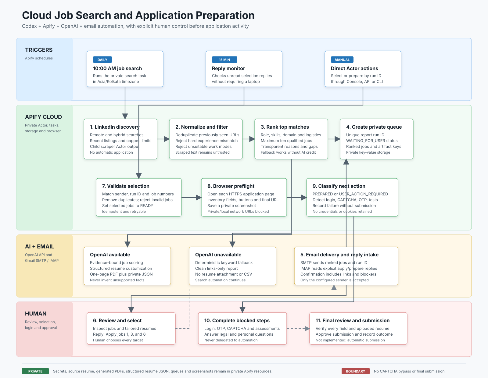
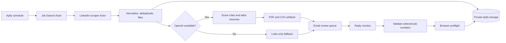
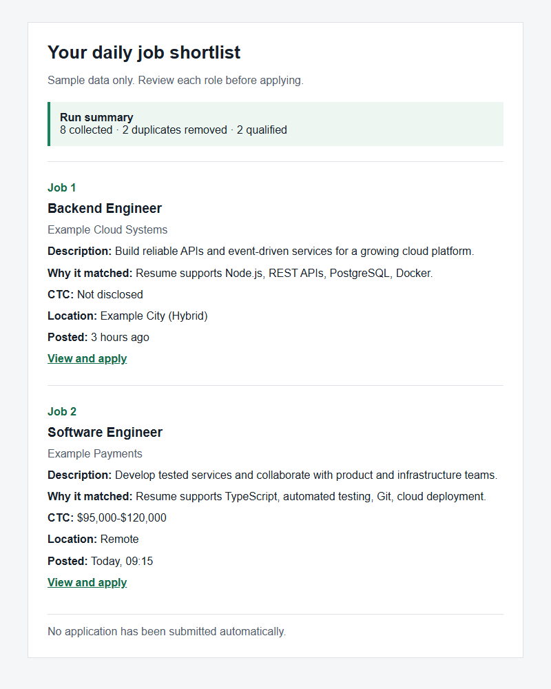

# Cloud Job Search Assistant

A private, human-in-the-loop job discovery workflow built with TypeScript and Apify Actors. It searches for recent LinkedIn roles, removes duplicates, filters hard mismatches, optionally uses OpenAI for structured fit analysis and truthful resume tailoring, and emails a review queue.

It does **not** submit applications automatically.

For a fresh deployment, follow the [complete cloud setup guide](docs/SETUP.md). It includes private Actor deployment, secrets, scraper compatibility, Task inputs, schedules, testing, and production checks.

## Features

- Scheduled cloud execution; no always-on laptop required
- Remote and hybrid job discovery through a child Apify Actor
- Persistent deduplication with an Apify key-value store
- Configurable titles, employers, locations, experience ceiling, and salary target
- Structured OpenAI scoring and one-page ATS-readable PDF resumes
- Evidence-bound resume customization using a generic structured contract
- Clean links-only email when OpenAI is unavailable or out of credit
- HTML report, CSV export, dataset output, and private PDF storage
- Human review before any application activity
- Persistent application queue with unique report IDs and review statuses
- Validated selection intake using a report run ID and job numbers
- Gmail/IMAP reply monitoring with sender and command validation
- Playwright application-page preflight with screenshots and field discovery

## Architecture





## Sample email

The preview below uses fictional data and contains no candidate or account information.



## Privacy model

The source repository contains no resume, contact details, generated files, credentials, or real run data. Resume text is supplied at runtime and should be processed only by a **private** Actor. Generated reports and PDFs are stored in private Apify storage.

Required environment variables:

| Variable            | Purpose                          | Secret      |
| ------------------- | -------------------------------- | ----------- |
| `OPENAI_API_KEY`    | Fit scoring and resume tailoring | Yes         |
| `SMTP_USER`         | SMTP sender account              | Yes         |
| `SMTP_APP_PASSWORD` | SMTP application password        | Yes         |
| `REPORT_RECIPIENT`  | Report destination               | Recommended |
| `IMAP_USER`         | Reply-monitor mailbox            | Yes         |
| `IMAP_APP_PASSWORD` | Reply-monitor app password       | Yes         |

`IMAP_USER` and `IMAP_APP_PASSWORD` are optional when they are the same as the SMTP values. Gmail uses `imap.gmail.com:993` with SSL. OAuth is preferable for a multi-user/public service; app-password authentication is intended only for a private personal Actor.

Never put real values in `.env.example`, Actor source files, screenshots, issues, or commits. See [SECURITY.md](SECURITY.md).

## Local development

Requirements: Node.js 24+, npm, and the Apify CLI.

```bash
npm install
npm run build
npm test
npm run lint
```

Copy `.env.example` to `.env` only for local development. `.env` is ignored by Git. For a cost-free smoke test, use `mockJobs` and set `sendEmail` to `false`.

## Deploy to Apify

```bash
apify login
apify push
```

In Apify Console:

1. Keep the Actor private.
2. Open the Actor's environment-variable settings.
3. Add the required variables listed above and mark credentials as secret.
4. Open the Input tab and paste your resume text.
5. Customize search location, titles, employers, experience ceiling, and limits.
6. Run a small test before enabling a schedule.

An anonymized input template is available at [examples/input.example.json](examples/input.example.json).
Copy-ready private Task templates are available for [search](examples/search-task.example.json) and [reply monitoring](examples/monitor-task.example.json).

## Output modes

### OpenAI mode

Qualified roles receive structured match analysis. The Actor creates one truthful, job-specific PDF resume per selected role and attaches the PDFs and CSV to the email. OpenAI must return the generic contract documented in [docs/resume-customization.md](docs/resume-customization.md); unsupported job keywords are recorded as omitted instead of being added to the resume.

Each PDF has a matching private `RESUME-DATA-<runId>-<jobNumber>` JSON record. This keeps verified resume sections available for later human-reviewed form filling without committing personal data to GitHub. A fictional structure example is available at [examples/resume-structure.example.json](examples/resume-structure.example.json).

### Links-only fallback

If OpenAI is missing, unavailable, or out of credit, the workflow still sends a compact email containing:

- role and company
- short job description
- transparent keyword-match reason
- disclosed compensation
- location and work mode
- posting time
- application link

No resume or CSV attachment is sent in fallback mode.

## Application queue

Every report receives a unique run ID. Qualified jobs are copied to a private named key-value store with the initial status `WAITING_FOR_USER`. When OpenAI mode creates a resume, the matching PDF is stored under a run-specific private key.

To save choices from a report, run the Actor in `select` mode with the same private queue-store name:

```json
{
    "mode": "select",
    "runId": "00000000-0000-4000-8000-000000000000",
    "selectedJobNumbers": [1, 3, 6],
    "applicationQueueStoreName": "job-application-queue"
}
```

The Actor validates the run and job numbers, removes duplicate choices, and marks exactly those jobs as `READY`. Re-running the same selection is safe. Its `OUTPUT` record provides a compact confirmation for the next workflow stage.

Selection input can also be submitted directly through the Apify Console, API, or CLI. The workflow prepares application pages but does not complete or submit forms.

### Email reply monitoring

Run the Actor periodically in `monitor` mode:

```json
{
    "mode": "monitor",
    "applicationQueueStoreName": "job-application-queue",
    "maximumReplyMessages": 20,
    "prepareApplicationForms": true
}
```

Reply from the exact address configured in `REPORT_RECIPIENT`. Include one explicit command line and the run ID anywhere in the reply:

```text
Apply jobs 1, 3, and 6
Run: 00000000-0000-4000-8000-000000000000
```

The monitor ignores other senders and messages without `apply` or `prepare`. After a valid command, it updates the private queue, optionally performs browser preflight, sends a confirmation email, and marks the reply as read.

### Application-page preparation

Browser preflight opens each selected HTTPS application URL in isolated Playwright contexts. It records the final URL, page title, visible form fields, buttons, blockers, and a private screenshot. It blocks local/private URLs and does not type, upload, click submit, retain login sessions, or bypass site controls.

Jobs are marked `PREPARED`, `USER_ACTION_REQUIRED`, or `FAILED`. Login, CAPTCHA, OTP, assessments, and legal questions always remain human steps. Many job sites require an authenticated interactive browser, so cloud preflight may stop at the login page; that is expected and is reported rather than bypassed.

## Clone and configure

```bash
git clone https://github.com/Saurabh2404/cloud-job-search-assistant.git
cd cloud-job-search-assistant
npm ci
npm run build
npm test
apify login
apify push
```

Create a private Apify Task in `search` mode for scheduled discovery and a separate recurring Task in `monitor` mode for replies. Submit `select` or `prepare` as separate Actor runs so the scheduled search task's resume and settings remain unchanged. Each user should choose unique `stateStoreName` and `applicationQueueStoreName` values within their own Apify account.

The LinkedIn scraper is selected through `linkedinScraperActorId`, so another compatible scraper can be used without editing source code. See the [setup guide](docs/SETUP.md#4-choose-a-linkedin-scraper) for its required input and output contract.

## Scheduling

Create an Apify Task containing your private input, then attach an Apify Schedule in your preferred timezone. Start with small result limits and monitor the first runs before increasing volume.

## Cost controls

Costs come from Apify compute, the selected LinkedIn scraping Actor, and OpenAI API usage. Pricing changes over time, so review both provider dashboards. Use `maxResultsPerWorkMode` and `maxQualifiedJobs` to cap each run, and configure provider spending limits.

## Responsible use

- Review every job and resume before applying.
- Never fabricate qualifications, employment, education, dates, or metrics.
- Do not automate captchas, identity checks, assessments, legal declarations, or final submission.
- Follow job-site terms, rate limits, privacy requirements, and applicable law.
- Treat scraped descriptions as untrusted text.

## Development checks

GitHub Actions runs compilation and tests on pushes and pull requests. Before publishing a release, also run:

```bash
npm run build
npm run lint
npm test
npm run format:check
```

## License

MIT
